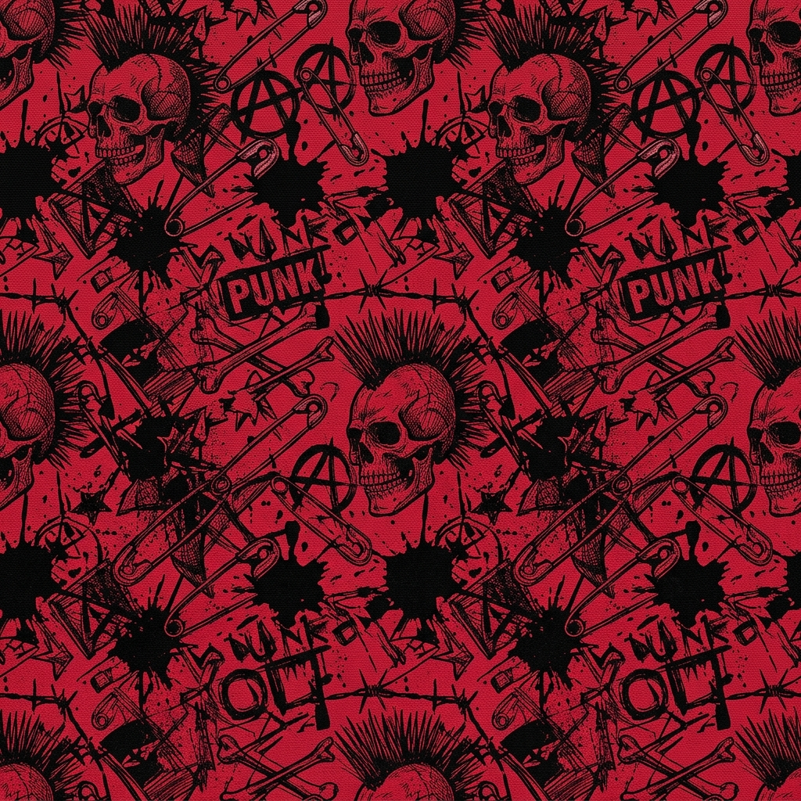
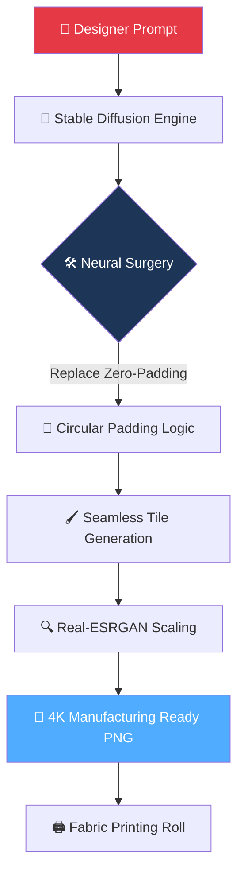

<div align="center">

# 🎸 PatternPunk-AI — Seamless Fabric Texture Synthesis

[](https://git.io/typing-svg)


<br/>

[](https://colab.research.google.com/)
[](https://github.com/mayank-goyal09/PatternPunk-AI/stargazers)
[](https://github.com/mayank-goyal09/PatternPunk-AI/network)

<br/>



<br/>

### 🧠 **Neural Brain Surgery: Forcing AI to Generate Perfectly Seamless Tiles** 

### **From Stable Diffusion (DreamShaper 8) → Manufacturing-Ready 4K Fabric Rolls** 👗

</div>

---

## ⚡ **THE DESIGN ENGINE AT A GLANCE**

<table>
<tr>
<td width="50%">

### 🎯 **The Problem We Solved**

The critical industry bottleneck in AI-assisted textile design is **visible "seams"**. Standard AI generation models use zero-padding, which creates abrupt edges that break when tiled for continuous fabric rolls.

**PatternPunk-AI Eliminates This By:**
- 🔨 **Neural Circular Padding** → Replacing zero-padding with circular logic to force "edge-aware" continuity.
- 🚀 **Real-ESRGAN 4K** → Upscaling low-res generations to professional manufacturing standards.
- 🛠️ **Monkey Patching** → A custom Python patch to resolve internal SD dependency conflicts.
- 📉 **Instant Prototyping** → A production-ready UI for immediate designer evaluation.

</td>
<td width="50%">

### ✨ **Project Highlights**

| Feature | Technical Implementation |
|---------|---------|
| 🎨 **Model Base** | DreamShaper 8 (Stable Diffusion) |
| 🔄 **Tiling Logic** | Custom Neural Circular Padding |
| 🔍 **Upscaling** | Real-ESRGAN (4K Output) |
| 🧪 **Patching** | Python Monkey Patch for SD classes |
| 🎨 **Output Format** | Manufacturing-Ready PNG (Seamless) |
| 📱 **UI Platform** | Interactive Gradio/Colab UI |
| ⚡ **Speed** | 10-15s per high-res tile |
| 🛡️ **Edge Aware** | Zero boundary detection artifacts |

</td>
</tr>
</table>

---
## 🛠️ **TECHNOLOGY STACK**

<div align="center">


</div>

| **Category** | **Technologies** | **Purpose** |
|:------------:|:-----------------|:------------|
| 🪄 **Generative AI** | Stable Diffusion (DreamShaper 8) | Core texture synthesis |
| 🔬 **Neural Logic** | Custom Circular Padding | Enforcing seamless tiling |
| 🔍 **Super Resolution** | Real-ESRGAN | 4K upscaling for fabric printing |
| 🐍 **Code Patching** | Python Monkey Patching | Overcoming technical dependency hurdles |
| 🖼️ **Image Processing** | PIL, OpenCV | Texture post-processing |
| 🚀 **UI Deployment** | Gradio / Google Colab | Interactive designer interface |

---

## 🔬 **THE NEURAL BRAIN SURGERY**



### **The Technical Breakdown:**

<table>
<tr>
<td>

#### 🔄 **1. Circular Padding Logic**
Standard AI models fail because they don't know the left edge must match the right. We perform "brain surgery" on the model's layers, replacing padding with **Circular Padding**, ensuring the AI views the image as a continuous loop.

</td>
<td>

#### 🐵 **2. Python Monkey Patch**
Directly modifying complex SD models often causes dependency crashes. We implemented a **Custom Monkey Patch** to swap Conv2d layers at runtime, preserving model stability while unlocking tiling capabilities.

</td>
</tr>
<tr>
<td>

#### 🔍 **3. Real-ESRGAN Upscaling**
Industrial fabric printing requires 300+ DPI. We integrated **Real-ESRGAN** to transform 512px generations into crystal-clear 4K textures without losing the "punk" detail.

</td>
<td>

#### 🎨 **4. Production-Ready UI**
Designed for non-technical fashion designers, the **Colab-Based UI** provides instant control over aesthetics, prompts, and tiling resolution.

</td>
</tr>
</table>

---

## 🎨 **PROTOTYPING INTERFACE**

<div align="center">

### ✨ **Premium Designer UI for Instant Texture Generation**

</div>

<table>
<tr>
<td width="50%">

#### 🏠 **Parameters Section**
- **Aesthetic Prompts** for specific punk/grunge styles.
- **Negative Prompts** to exclude artifacts.
- **Denoising Strengths** for high-fidelity control.
- **One-Click Tiling** toggle.

</td>
<td width="50%">

#### 🖼️ **Preview Section**
- **Real-Time Rendering** of the generated tile.
- **3x3 Tiled Preview** to verify seamlessness.
- **One-Click Download** in 4K resolution.
- **Prompt History** log.

</td>
</tr>
</table>

---

## 📂 **PROJECT STRUCTURE**

```bash
🎸 PatternPunk-AI/
│
├── 🧠 main_inference.ipynb           # Colab-based production UI & logic
├── 🛠️ core_logic/
│   ├── circular_padding.py          # The "Neural Brain Surgery" implementation
│   └── monkey_patch.py              # SD dependency conflict resolution
│
├── 🔍 upscaling/
│   └── real_esrgan_wrapper.py        # 4K upscaling pipeline
│
├── 🗂️ models/
│   └── dreamshaper_8_weights/       # Cached weights (private/remote)
│
├── 🖼️ output/                       # Generated seamless textures
├── 📦 requirements.txt              # Project dependencies
└── 📖 README.md                     # You are here! 🎉
```

---

## 🚀 **HOW TO RUN ON COLAB**

<div align="center">

[](https://colab.research.google.com/)

</div>

### **Step 1: Open the Notebook** 📥
Click the "Open in Colab" badge above to load the production environment.

### **Step 2: Connect to GPU** ⚡
Ensure your runtime is set to **T4 or A100 GPU** for high-speed generation.

### **Step 3: Run Setup Cells** 📦
Execute the initialization code to install dependencies and apply the **Circular Padding Monkey Patch**.

### **Step 4: Launch the UI** 🎨
Run the final cell to launch the **Gradio Interface**. Enter your prompt (e.g., *"Hand-drawn red and black punk patterns with safety pins"*) and hit Generate!

---

